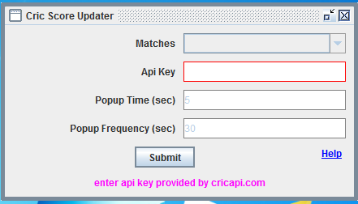
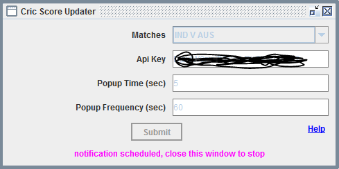
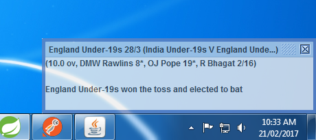

# Cric Score Updater
A desktop java application which shows score via a popup repeatedly.

# Configuration
* **Api Key:** This application requires only an api key provided by http://www.cricapi.com. You can easily get it just by signing up on the site without any cost.
* **Popup Time:** A popup time in sec (default 5 sec). Each popup will disappear automatically after this time expires.
* **Popup Frequency:** After this amount of time popup will appear again (default 30 sec).

# Downloads
Download an executable jar cric-ui-0.0.1-SNAPSHOT.jar from the releases section of the repository. [RELEASE](https://github.com/hemantsonu20/cric-score-updater/releases)

# Snapshots
**Configuration screen after api key provided**: When api key is provided, matches combo box is populated with current ongoing matches. Once you select the match, popup notification will be scheduled.

**Sample poupup notification**

